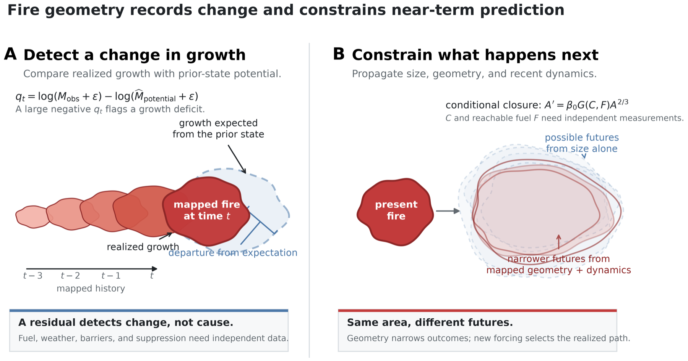

# Detection and Prediction Concept Figure

This publication schematic explains the theory's diagnostic and prospective
logic without substituting a conceptual drawing for measured performance.



## Interpretation

Panel A treats detection as a realization residual: growth observed over the
current interval is compared with growth expected from the preceding mapped
state. A large negative residual identifies departure from that trajectory.
It does not identify fuel limitation, weather, barriers, or suppression.

Panel B treats prediction as propagation of a compressed mapped state. Area
alone permits a broad set of possible futures; current geometry and recent
dynamics narrow near-term possibilities. The displayed
`A' = beta_0 G(C,F) A^(2/3)` relation is a conditional closure. Coherence `C`
and reachable fuel `F` are latent unless independently observed, and new
forcing can move the fire outside the forecast regime.

All footprints are deterministic synthetic polygons. They are not wildfire
observations, fitted forecasts, or evidence of empirical detection skill.
Measured performance remains in the
[final state, scale, detection, and prediction audit](FINAL_STATE_SCALE_PREDICTION_AUDIT.md).

## Reproduction

```bash
MPLCONFIGDIR=tmp/matplotlib-cache PYTHONPATH=src:. \
  .venv/bin/python scripts/build_detection_prediction_concept_figure.py
```

The script writes PDF, SVG, 600-dpi PNG, a caption, and provenance metadata to
`outputs/conceptual_detection_prediction/`.
