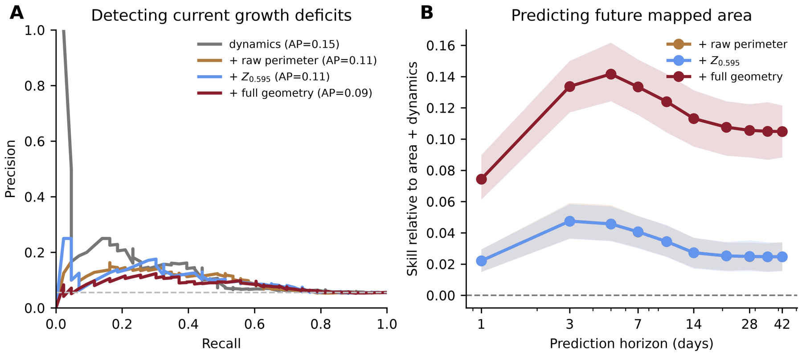

# Final State, Scale, Detection, and Prediction Audit

## Bottom line

The strongest defensible statement is:

> **The mapped geometry of a growing fire is an evolving record of its past
> dynamics and contains reproducible information about future mapped growth,
> but it does not reliably identify a current unexpected growth deficit or its
> physical cause.**

Two-thirds normalization is not special. Across the fixed `1/2`, `2/3`,
`3/4`, and development `0.595` candidates, the median held-out loss spread is
`0.000014` and the largest spread over the primary targets and horizons is
`0.00163`. Once area and recent area change are known, these normalizations
are algebraic reparameterizations of perimeter and perimeter change.

Full mapped geometry is different. For future area, it improves on raw
perimeter at every locked horizon. At seven days, event-weighted mean absolute
log-area error is `0.525` for area plus dynamics, `0.504` for perimeter or any
normalization, and `0.455` for full geometry. The full-versus-perimeter paired
difference is `-0.0487` (`-0.0573` to `-0.0394`), resampling whole fires.

## Locked design

- Cohort: 4,032 FIRED fires and 166,510 origin-horizon rows.
- Development: 2001-2012; calibration: 2013-2015; held out: 2016-2020.
- Horizons: 1, 3, 5, 7, 10, 14, 21, 28, 35, and 42 days.
- Candidate exponents: `0.5`, `2/3`, `0.75`, and the development-only within-fire estimate `0.594994`.
- Continuous models: standardized ridge, regularization selected on calibration MAE.
- Binary models: standardized ridge-logistic, regularization selected on calibration Brier score; classification threshold selected on calibration balanced accuracy.
- Uncertainty: 1,000 whole-fire bootstrap replicates.
- Information boundary: predictors use only mapped state through the forecast origin. The headline detection model instead uses the mapped endpoint and is explicitly contemporaneous.

The held-out years have appeared in earlier repository analyses. This is a
fixed synthesis rerun, not a pristine first opening of an untouched test set.

## Detection result

The primary detection target is the existing lower-decile realization-deficit
indicator for the fixed three-day interval from event day 7 through day 10.
Potential growth is predicted at day 7; the day-10 mapped features are used to
identify the deficit after it has occurred. This is detection, not prediction.
The threshold was defined before held-out evaluation.

Among 773 held-out fires, prevalence is `0.0556`. Recent dynamics alone have
ROC AUC `0.619` (`0.524-0.722`) and average precision `0.154`
(`0.081-0.258`). Adding raw perimeter raises threshold-dependent balanced
accuracy from `0.574` to `0.630`, but precision falls from `0.222` to `0.103`
and average precision falls to `0.105`. Full geometry has ROC AUC `0.611`,
average precision `0.086`, balanced accuracy `0.606`, and precision `0.091`.
Thus geometry does not provide a reproducible improvement for the headline
current-deficit detection task. Same-interval OT is uninformative in its much
smaller 121-fire subset and is not prospective.

## Prediction result

For future mapped area, full geometry has event-weighted skills relative to
area plus dynamics of `7.4%`, `13.4%`, `14.2%`, `13.3%`, `12.4%`, `11.3%`,
`10.8%`, `10.6%`, `10.5%`, and `10.5%` from 1 through 42 days. Absolute error
rises with horizon, but relative skill remains modestly positive.

Full geometry also reduces held-out loss beyond raw perimeter for realized
coupling and acceleration sign at every horizon. Its growth-deficit gains are
small and clearest at 5-21 days. Termination gains are concentrated at 1-14
days and disappear once nearly every fire has reached the mapped terminal
increment. These are predictive associations, not mechanism identification.

Prior reorganization improves future-area prediction in the matched 313-fire
subset: at seven days, M5 minus M4 loss is `-0.0413` (`-0.0526` to `-0.0299`).
Because availability selects a smaller transport subset and earlier integrated
analyses found smaller coupling gains, this is supporting evidence, not a
general cohort-wide claim.

## Fifteen decisions

1. **Is predictive information special to 2/3 normalization? NOT SUPPORTED.** Candidate normalized models are effectively indistinguishable, as expected from their shared linear information with area.
2. **Does development `0.595` predict better? NOT SUPPORTED.** It does not reproducibly beat `1/2`, `2/3`, or `3/4`; it remains useful only as the development drift-removing summary.
3. **Does raw perimeter explain the same information? SUPPORTED.** Raw perimeter and normalized geometry have nearly identical future-area scores at all horizons.
4. **Does full geometry add beyond perimeter? SUPPORTED for prediction.** Boundary excess, topology, and change features reduce loss beyond raw perimeter for area, coupling, acceleration, and several transition horizons. It is not supported for current-deficit detection.
5. **Does prior spatial reorganization add beyond geometry? PARTIALLY SUPPORTED.** It improves several outcomes in the 313-fire matched subset, but coverage is limited and cohort transfer is unresolved.
6. **Which scale dependence is demonstrated? SUPPORTED.** Temporal cadence, area scale, lifecycle, boundary definition, estimator, and error model all change the relationship.
7. **Is true spatial multi-resolution dependence tested? UNRESOLVED.** No independent spatial-resolution product exists in the repository.
8. **Can we say “geometric state”? PARTIALLY SUPPORTED.** “Mapped geometric state” is justified for multivariate prediction because full geometry beats perimeter and one-dimensional normalization. It must not imply an observed latent coherence state or a unique mechanism.
9. **What can we detect? SUPPORTED as a defined task.** We can attempt contemporaneous identification of a locked major realized-growth deficit over days 8-10 using the day-10 mapped fire.
10. **How accurately can we detect it? NOT SUPPORTED as strong detection.** Average precision is at most `0.154`, confidence intervals are wide, and geometry does not improve ranking over recent dynamics.
11. **What can we predict? SUPPORTED.** Future mapped area is the clearest target; geometry also predicts realized coupling, acceleration sign, near-term deficit risk, and near-term mapped termination probability.
12. **How accurately can we predict? PARTIALLY SUPPORTED.** Full-geometry area MAE is `0.276`, `0.455`, and `0.544` at 1, 7, and 42 days, respectively, with `7-14%` skill over dynamics.
13. **How quickly does skill decay? PARTIALLY SUPPORTED.** Absolute error grows rapidly, while relative geometry skill peaks near five days and remains near `10%` through 42 days.
14. **What belongs in MAIN?** The held-out detection PR panel and future-area skill panel belong in MAIN, including the negative detection result. Fixed-normalization, target-by-horizon, calibration, scale, sample-size, and bootstrap details belong in SI.
15. **What remains unresolved? UNRESOLVED or NOT IDENTIFIABLE.** Active fireline behavior, independent spatial resolution, reachable fuel, future fire-scale weather, suppression, barriers, and coherence require new measurements; FIRED cannot attribute a residual to any of them.

## Scale conclusion

The authoritative inventory is [Geometric Scale Audit](GEOMETRIC_SCALE_AUDIT.md).
Scale dependence is empirically supported across available observation and
lifecycle dimensions. **TRUE SPATIAL MULTI-RESOLUTION SCALING REMAINS
UNRESOLVED.**

## Main and SI outputs

The main PDF/SVG/PNG and eight SI figure families are under
`outputs/final_state_audit/`. Every main and SI series is traced in
`figure_provenance.csv`. Numeric sources are `target_horizon_metrics.csv`,
`paired_model_comparisons.csv`, `detection_metrics.csv`,
`detection_curve_points.csv`, `detection_calibration.csv`,
`sample_sizes.csv`, and `scale_dependence_summary.csv`; row-level predictions
and bootstrap distributions are retained as Parquet files.

## Stopping rule and new data

This audit closes exponent, threshold, lifecycle-partition, deficit-cutoff,
and horizon searches on FIRED. Remaining questions require new data:
independent active-fireline measurements, independent spatial products,
prospective reachable-fuel maps, future fire-scale weather, suppression
records, independently observed barriers, and an independent coherence
measurement. Negative detection results are final results, not a reason to
retune the target.

