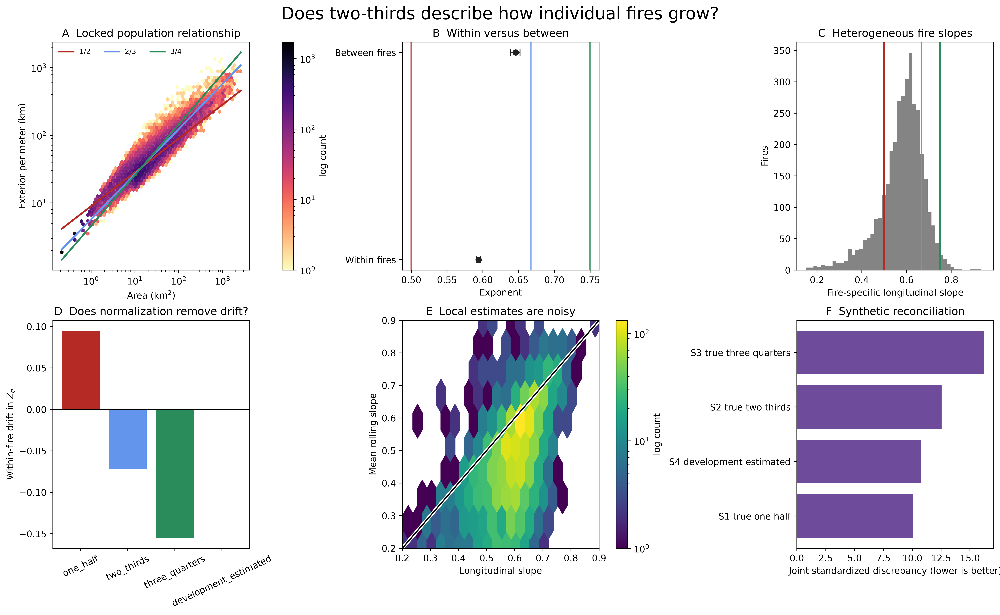

# Geometric manifold validation

## Plain-language verdict

**In the locked FIRED cohort, two-thirds describes differences among fires more closely than it describes how the average individual fire grows.** The population exponent is 0.614, the between-fire exponent is 0.646, and the within-fire exponent is 0.594. The held-out result is almost identical: 0.643 between fires and 0.595 within fires.

The between-fire estimate is within the prespecified practical-resolution band of 2/3, although its narrow bootstrap interval excludes the exact value. The within-fire estimate is incompatible with 1/2, 2/3, and 3/4 at the precision of this dataset and instead supports a development-locked exponent near 0.595. Fire-specific slopes, lifecycle dependence, perimeter definition, temporal thinning, and error model all matter. A universal, observation-invariant wildfire exponent is therefore **not supported**.



## Design and provenance

The analysis reuses the locked cohort and outcome-blind temporal split:

| Partition | Years | Fires | Positive mapped-increment observations |
| --- | ---: | ---: | ---: |
| Development | 2001-2012 | 2,316 | 25,997 |
| Calibration | 2013-2015 | 552 | 6,244 |
| Held out | 2016-2020 | 1,164 | 13,405 |
| Total | 2001-2020 | 4,032 | 45,646 |

Area is FIRED cumulative mapped area. The primary boundary is cumulative exterior perimeter. Whole fires, not daily rows, are the bootstrap unit. The 1,000-replicate design, checksums, eligibility rules, and estimator choices are frozen in `outputs/geometric_manifold_validation/design_lock.json`.

The repository contains the supplied broad-event PNG and the earlier level-set/model plotting pipeline, but not the exact source table or plotting script for the 237,235-event FIRED figure. That figure's reported slope near 0.66 is therefore retained as historical cross-sectional context, not claimed as reproduced. The locked cohort is reproducible from repository artifacts and is the inferential dataset here.

## Methodological basis

- Pélabon et al. distinguish static, cross-individual allometry from ontogenetic change within an individual. This motivates separate between-fire and within-fire estimands. *American Naturalist* 181:195-212 (2013), [doi:10.1086/668820](https://doi.org/10.1086/668820).
- Mundlak's correlated-random-effects construction motivates decomposing `log A` into within-fire deviation and event mean. *Econometrica* 46:69-85 (1978), [doi:10.2307/1913646](https://doi.org/10.2307/1913646).
- Bell et al. explain why within-between models expose distinct estimands and why random slopes should be tested. *Quality & Quantity* 53:1051-1074 (2019), [doi:10.1007/s11135-018-0802-x](https://doi.org/10.1007/s11135-018-0802-x).
- Warton et al. show that OLS, SMA, and errors-in-variables fits answer different questions. *Biological Reviews* 81:259-291 (2006), [doi:10.1017/S1464793106007007](https://doi.org/10.1017/S1464793106007007).
- Xiao et al. show that log-linear and original-scale nonlinear fits encode different error assumptions. *Ecology* 92:1887-1894 (2011), [doi:10.1890/11-0538.1](https://doi.org/10.1890/11-0538.1).

These papers informed the design; none was copied mechanically.

## Population scaling

The locked pooled relationship is:

\[
\hat\sigma_{pop}=0.6136,
\qquad 95\%\;\text{fire-bootstrap interval }[0.6104,0.6168].
\]

Development, calibration, and held-out estimates are 0.6147, 0.6092, and 0.6133. The stability across time is strong, but this estimand mixes within-fire evolution with differences among fires. It does not reproduce the broader 0.66 figure and should not be substituted for it silently.

## Within versus between scaling

The correlated-random-effects decomposition is:

\[
\log P_{it}=\alpha+u_i+\sigma_W(\log A_{it}-\overline{\log A_i})+\sigma_B\overline{\log A_i}+\epsilon_{it}.
\]

The implementation exploits the exact orthogonality of event-centered area and event means. Whole-fire bootstrap intervals retain within-event dependence.

| Estimand | All fires | 95% interval | Held out | Held-out 95% interval |
| --- | ---: | ---: | ---: | ---: |
| Within-fire `sigma_W` | 0.5941 | 0.5917-0.5965 | 0.5950 | 0.5904-0.5997 |
| Between-fire `sigma_B` | 0.6459 | 0.6391-0.6520 | 0.6426 | 0.6312-0.6535 |

The practical equivalence half-width was locked at 0.03 from development uncertainty and scientific resolution. Under that rule, between-fire scaling is practically compatible with 2/3; within-fire scaling is not compatible with 1/2, 2/3, or 3/4.

## Fire-specific heterogeneity

Eligibility was fixed before held-out inspection: at least seven observations, at least a factor-of-two area range, and at least seven days. This retained 3,540 fires.

The median event slope is 0.593, with interquartile range 0.531-0.641 and 2.5%-97.5% range 0.282-0.735. A bivariate random-intercept/random-slope meta-analytic model estimates a mean slope of 0.5831 (hierarchical interval 0.5798-0.5864) and between-fire slope SD 0.0883. Intercept and slope are positively correlated (`r=0.31`).

The random-slope model establishes real heterogeneity, but noisy early event-specific slopes did not improve prospective held-out continuation: log-perimeter RMSE was 0.428 for empirical-Bayes early slopes versus 0.290 for the common development slope. More flexibility is not automatically more predictive.

## Power-law adequacy and lifecycle

A development-fitted cubic in `log A` achieved held-out anchored RMSE 0.334, versus 0.370 for fixed 2/3 and 0.441 for the development-fixed exponent. Its implied derivative declines from about 0.75 at the 10th area percentile to 0.45-0.48 over the upper half of the range. This supports scale dependence rather than a single exact power law.

Held-out phase-specific estimates were 0.700 early, 0.519 middle, and 0.138 late. The late value is especially vulnerable to small remaining area increments and should be interpreted as mapped-boundary flattening, not a new universal phase exponent.

## Normalization test

For `Z_sigma = log P - sigma log A`, the within-fire drift is exactly `sigma_W - sigma`. Held-out estimates are:

| Normalization | Observed drift | Expected if true exponent were 2/3 |
| --- | ---: | ---: |
| 1/2 | +0.0950 | +1/6 = +0.1667 |
| 2/3 | -0.0716 | 0 |
| 3/4 | -0.1550 | -1/12 = -0.0833 |
| Development estimate 0.5950 | +0.00005 | not applicable |

Thus `Z_2/3` decreases systematically as individual fires grow. The development-estimated normalization, not 2/3, removes held-out size drift.

## Observation robustness

The primary conclusion is stable in direction but not observation invariant:

- Exterior-perimeter held-out within slope: 0.595.
- Total-perimeter held-out within slope: 0.623.
- Exterior perimeter every second observation: 0.616.
- Exterior perimeter every third observation: 0.628.
- Conditional OLS, Deming, and SMA exterior slopes: 0.595, 0.606, and 0.616.
- Additive-error original-scale profiling gives 0.375 in held-out fires, far below the lognormal result; residual heteroscedasticity makes this error model consequential.

True multi-resolution sensitivity remains **UNRESOLVED**. The source is approximately 500 m; rerasterizing the same geometry would not create an independent resolution experiment.

## Local-slope reconciliation

Rolling seven-observation slopes are much noisier than longitudinal slopes. In held-out fires, the median local-error variance is 0.064 and median lag-one autocorrelation is 0.91. Mean rolling slope correlates only 0.57 with the fire-specific longitudinal slope. Absolute local error is strongly larger when the rolling log-area span is small (`rho=-0.69`). This explains how a stable longitudinal relationship can coexist with erratic local derivatives.

The synthetic test nevertheless rejects a simple measurement-noise reconciliation. Simulations at true exponents 1/2, 2/3, 3/4, and 0.595 used real development area trajectories, real observation schedules, calibrated event-prefactor variation, and calibrated AR(1) log-perimeter noise. None reproduced the joint observed pattern; the best relative discrepancy was still 10.1 standardized units RMS. A true 2/3 manifold reproduced neither the held-out within slope nor the unusually persistent/noisy local behavior. More structured observation error or genuinely evolving geometry is required.

## Geometric state and prediction

`Z_2/3` is persistent (held-out lag-one correlation 0.81) but not stationary: 74% of its variance is within-fire and it drifts downward with area. It is a useful geometric predictor, not evidence of coherence or metabolism.

Against an origin-safe area-and-dynamics baseline, adding local slope alone changed held-out error very little. Adding `Z_2/3` and its past change improved every tested horizon for future mapped area, realized coupling, acceleration sign, and termination. At seven days, log-area RMSE fell from 0.365 to 0.321; full geometry reached 0.286. For OT reorganization, `Z` gave modest gains and full geometry performed best. `Z_2/3` also correlates with held-out realization residual `q` (`rho=0.18-0.28` across horizons), while `delta Z` is weak. These results do not identify `Z` as a latent constraint: it is partly a perimeter-level measurement and other normalizations may carry similar information.

## Theory verdict

The evidence supports a stable descriptive hierarchy:

1. FIRED has a strong population perimeter-area relationship.
2. Much of the near-two-thirds appearance is between-fire.
3. Average within-fire growth is nearer 0.595 than 2/3.
4. Fire-specific slopes vary and change with scale, lifecycle, perimeter definition, and cadence.
5. Normalized geometry helps prediction, but its utility does not uniquely validate the 2/3 mechanism.

The geometric closure remains a conditional theoretical construction. It is not an empirically established universal law for cumulative mapped wildfire perimeters.

## Claims table

| Claim | Result | Verdict |
| --- | --- | --- |
| Population P-A scaling is near 2/3 | Locked slope 0.614; broader 0.66 artifact not exactly reproducible here | PARTIALLY SUPPORTED |
| Between-fire scaling is near 2/3 | 0.646; within practical band, exact 2/3 outside narrow interval | PARTIALLY SUPPORTED |
| Within-fire growth scaling is near 2/3 | 0.594 overall; 0.595 held out | NOT SUPPORTED |
| 1/2 describes within-fire growth | 0.5 is also outside the interval and practical band | NOT SUPPORTED |
| 3/4 describes within-fire growth | 0.75 is far outside the interval | NOT SUPPORTED |
| One common exponent is adequate | Substantial random-slope and lifecycle heterogeneity; flexible curve improves fit | NOT SUPPORTED |
| 2/3 normalization removes within-fire size drift | Held-out drift is -0.0716 | NOT SUPPORTED |
| Local slope is a stable state variable | High variance and area-span sensitivity | NOT SUPPORTED |
| `Z_2/3` is a useful state variable | Adds held-out predictive information but is not stationary or mechanism-specific | PARTIALLY SUPPORTED |
| True 2/3 plus calibrated measurement noise reproduces local behavior | Joint discrepancy is large; no synthetic candidate is adequate | NOT SUPPORTED |
| 2/3 is a local attractor | Previous adversarial result | NOT SUPPORTED |
| 2/3 uniquely identifies metabolism | Algebra and observations do not identify mechanism | NOT IDENTIFIABLE |

## Reproduction

```bash
PYTHONPATH=src ../cubedynamics/.venv/bin/python \
  scripts/run_geometric_manifold_validation.py
```

Machine-readable results and vector/raster figures are in `outputs/geometric_manifold_validation/`.
