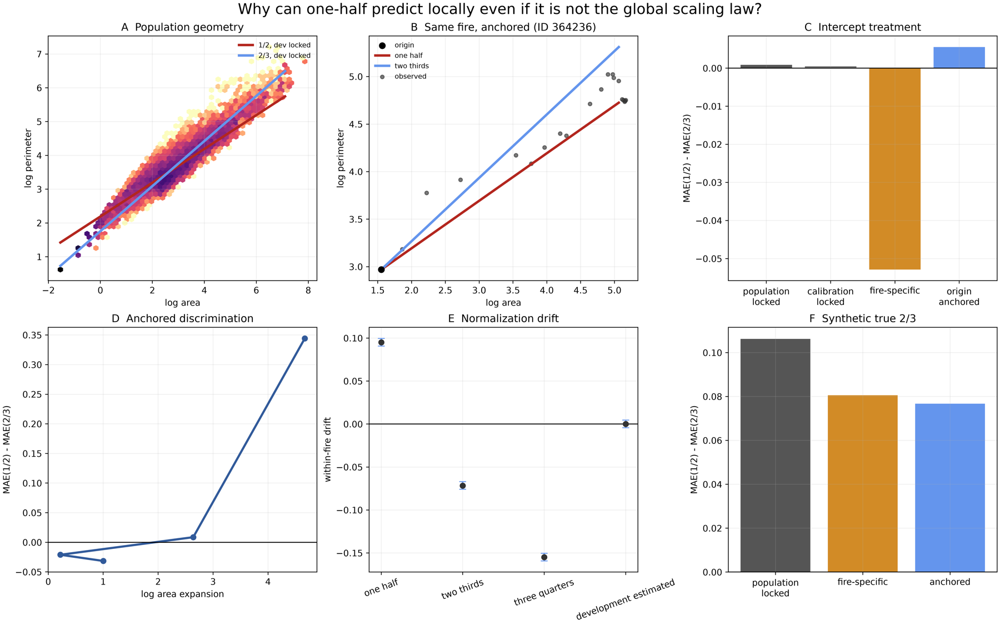

# Re-audit of One-Half Under Explicit Normalization

## Direct answer

**Why did one-half appear competitive in previous tests?** Mostly because
several results were not tests of a population perimeter-area law. They tested
one-half as a temporal area-growth exponent, a fixed target for a noisy future
local slope, a fire-conditioned geometric trajectory, or an origin-anchored
extrapolation. These remain legitimate tests, but they answer different
questions.

When evaluated as a population geometric law with its coefficient learned on
development fires and locked before held-out evaluation, one-half was worse
than both two-thirds and the development-estimated exponent. On 13,405
independent held-out geometry observations, log-perimeter MAE was `0.276` for
one-half, `0.247` for two-thirds, and `0.231` for the development exponent
`0.595`. With fires weighted equally, one-half exceeded two-thirds loss by
`0.0226` (95% whole-fire bootstrap interval `0.0157-0.0291`), while the
development exponent improved on two-thirds by `0.0141` (`0.0112-0.0169`).

Giving every fire a retrospective fitted intercept changes the comparison.
Across the same repeated transition targets, one-half then has MAE `0.143`,
versus `0.196` for two-thirds and `0.160` for the development exponent. The
intercept-adaptation gain is `0.092` for one-half and `0.058` for two-thirds;
their gain difference is `0.0344` (`0.0270-0.0422`). This is strong evidence
that one-half receives more benefit from fire-specific conditioning. It is not
evidence for a common one-half normalization.

Origin anchoring by itself does not make one-half the overall winner. Anchored
MAE is `0.235` for one-half, `0.230` for two-thirds, and `0.216` for the
development exponent. One-half is locally competitive where area expansion is
small, but loses sharply in the extreme-expansion bin. Limited geometric
leverage explains near-ties at short range; it does not make the exponents
equivalent.



The full-resolution figure is under
`outputs/half_power_reaudit/figure1_why_one_half_can_predict_locally.*`.

## Locked design

The audit reused the existing cohort and changed no inclusion rule:

| Partition | Years | Fires | Positive-increment geometry observations |
|---|---:|---:|---:|
| Development | 2001-2012 | 2,316 | 25,997 |
| Calibration | 2013-2015 | 552 | 6,244 |
| Held out | 2016-2020 | 1,164 | 13,405 |
| Total | 2001-2020 | 4,032 | 45,646 |

The perimeter is cumulative exterior polygon perimeter. Geometry observations
are retained only on positive FIRED daily-increment days, matching the locked
geometric-manifold analysis. The candidates are `1/2`, `2/3`, `3/4`, and the
development-only within-fire estimate `0.594994`. Primary losses are absolute
log-perimeter error. Repeated-observation uncertainty resamples whole fires
1,000 times.

The audit distinguishes:

- **population one-half law:** a development coefficient is locked before test
  fires;
- **fire-conditioned one-half scaling:** one coefficient is fitted per fire;
- **origin-anchored one-half extrapolation:** each curve passes through the
  current state;
- **one-half local-slope shrinkage:** the future rolling derivative is pulled
  toward one-half;
- **one-half temporal area growth:** `A'=beta A^(1/2)`.

## Inventory and semantics

The repository-wide inventory identified 21 principal analysis/figure/formal
objects, with source, response, predictor, intercept treatment, category A-F,
split, conclusion, and rerun status. It is in
`half_power_inventory.csv`. The semantic audit is in `semantic_audit.csv`.

The most consequential correction is to the prior constraint report. Its loss
difference compared **fixed centers for future rolling slopes**. It is category
E local-slope shrinkage, not a test of `P=cA^sigma`. Its numerical result is
preserved, but it should not be cited as evidence that a universal one-half
perimeter law predicts better.

Temporal transformed-area forecasts are category F. They remain valid tests of
area trajectories through time and are not reinterpreted as perimeter-area
scaling.

## Main factorial comparison

All entries below score the same 42,718 held-out transition targets. These
targets repeat future observations across origins and horizons, so they answer
a transition-prediction question rather than the independent-observation
population-law question above.

| Exponent | Population locked | Calibration locked | Fire-specific full | Origin anchored |
|---|---:|---:|---:|---:|
| `1/2` | 0.2480 | 0.2480 | **0.1434** | 0.2354 |
| `2/3` | 0.2471 | 0.2475 | 0.1962 | 0.2299 |
| `3/4` | 0.3175 | 0.3185 | 0.2524 | 0.2755 |
| development `0.595` | **0.2172** | **0.2173** | 0.1600 | **0.2161** |

The observation-weighted population transition losses make one-half and
two-thirds nearly tied. When each fire is weighted equally, one-half is better
on these repeated transition targets by `0.0208` (`0.0132-0.0285`). This does
not contradict the independent-observation result: transition construction
changes the target frequency and weighting, especially for long fires. The
conclusion that the development exponent is best is stable under both.

A prospective history-only fire intercept was also retained. It is not the
category C diagnostic and performs worse because early histories estimate an
unstable intercept from few observations. Its presence in the output prevents
retrospective fire fitting from being confused with an operational forecast.

## Intercept adaptation

For `gain = population loss - adapted loss`:

| Candidate | Full-fire gain | Origin-anchor gain |
|---|---:|---:|
| `1/2` | 0.0920 (`0.0846-0.0993`) | -0.0175 (`-0.0253--0.0093`) |
| `2/3` | 0.0577 (`0.0516-0.0631`) | 0.0088 (`0.0033-0.0144`) |
| Development `0.595` | 0.0665 (`0.0612-0.0722`) | -0.0031 (`-0.0086-0.0027`) |

The extra full-fire benefit to one-half relative to two-thirds is `0.0344`
(`0.0270-0.0422`). This supports the intercept-conditioning explanation for
fire-specific tests. Origin anchoring is different: it slightly harms
one-half overall and slightly helps two-thirds, so the explanation is not
simply “anchoring always makes one-half win.”

## Population, between-fire, and within-fire geometry

Held-out zero-drift exponents are:

- population: `0.6133`;
- between fires: `0.6426`;
- within fires: `0.5950` (`0.5907-0.5997`).

The within-fire normalization drifts are:

| Normalization | Held-out within drift |
|---|---:|
| `P/A^(1/2)` | `+0.0950` (`0.0907-0.0997`) |
| `P/A^(2/3)` | `-0.0716` (`-0.0760--0.0670`) |
| `P/A^(3/4)` | `-0.1550` (`-0.1593--0.1503`) |
| development `0.595` | `+0.00005` (contains zero) |

Thus one-half does not remove systematic within-fire size drift. Neither does
two-thirds. The exponent that does is approximately `0.595`, independently
reproducing the development estimate. Between-fire scaling remains much closer
to two-thirds. This supports outcomes C and D: the empirical within-fire law is
between the theoretical references, and the near-two-thirds population signal
is primarily a between-fire relationship.

## Local-slope shrinkage

The exact prior rolling-OLS estimator and horizons were preserved. At one day,
two-thirds has a tiny advantage over one-half (`0.2172` versus `0.2207`). At 3,
5, 7, 10, and 14 days, one-half has lower future-slope MAE than two-thirds.
This result is correctly labeled **one-half local-slope shrinkage**.

A development/calibration-selected center improves MAE further, but the chosen
center is not stable: it hits `0.8` at one day and the lower grid boundary
`0.3` at longer horizons. That behavior rejects a simple claim that the best
constant target is biologically one-half. The useful prediction is generic
shrinkage/dynamics of a noisy rolling derivative, not a universal geometric
manifold.

## Area expansion and geometric leverage

For anchored candidates,

\[
\frac{P_{2/3}}{P_{1/2}}=(A_{future}/A_0)^{1/6}.
\]

Development log-area-ratio quantiles fixed four bins before held-out scoring.
Aggregating held-out origins with transition counts as weights:

| Expansion bin | Approx. median area ratio | Theoretical candidate ratio | Anchored MAE(1/2)-MAE(2/3) |
|---|---:|---:|---:|
| Low | 1.13 | 1.02 | -0.0098 |
| Moderate | 2.65 | 1.18 | -0.0347 |
| High | 14.1 | 1.55 | +0.0290 |
| Extreme | 111 | 2.19 | +0.3245 |

One-half can win locally where the candidate curves differ by only a few to
roughly 18 percent. At large expansion, two-thirds wins, and the separation is
large. A short-horizon tie is therefore low-leverage evidence, not exponent
equivalence.

## Long trajectories

Eligibility was fixed from development 75th percentiles: at least 13 geometry
observations, 17 days, and log-area span `4.828`. This selected 147 held-out
fires.

| Treatment | One-half MAE | Two-thirds MAE |
|---|---:|---:|
| Population locked | 0.3006 | **0.2513** |
| Fire-specific full | **0.1543** | 0.2093 |
| Origin anchored | 0.2347 | **0.2219** |

The long-trajectory result is the cleanest demonstration of the distinction.
Two-thirds beats one-half when normalization is locked or only the current
origin is supplied. One-half wins when the whole realized fire is used to fit
its intercept retrospectively. The scientific interpretation changes with the
normalization treatment.

## Constraint mixture

The new geometric test calculates `D=L(1/2)-L(2/3)` under each intercept
treatment and merges it with the origin-safe realization residual `q`.
Continuous `q-D` correlations vary by horizon and treatment and do not support
a stable deficit-based rescue of one-half. Across matched rows, weighted mean
`D` is about `+0.0068` for population locking, `-0.0521` for retrospective
fire-specific fitting, and `-0.0377` for origin anchoring. The sign change is
primarily an intercept-treatment result. No consistent pattern supports
attributing it to suppression or fuel restriction.

The earlier category E conclusion also remains: negative realization deficits
did not explain why a one-half shrinkage center sometimes forecast future
rolling slopes well. This result should remain framed as association, not
causal attribution.

## Synthetic validation

Synthetic fires used real area trajectories, observation counts and spacing,
empirical fire-intercept variance, and empirical residual noise. Twenty
replicates were generated for true `1/2`, `2/3`, `3/4`, and development
exponents, crossed with population, fire-specific, and anchored scoring.

For true two-thirds data, mean MAE was:

| Treatment | One-half | Two-thirds |
|---|---:|---:|
| Population locked | 0.332 | **0.226** |
| Fire-specific full | 0.250 | **0.170** |
| Origin anchored | 0.328 | **0.251** |

Conditioning narrows the one-half disadvantage but does not reverse it. A true
fixed two-thirds generator did not reproduce the observed fire-specific
one-half win. The real result therefore reflects more than the algebra of
anchoring alone, consistent with heterogeneous trajectories and a mean
within-fire exponent near `0.595` rather than a single exact manifold.

## Figure and language audits

`figure_intercept_audit.csv` records how each reference line was normalized.
Several lines are display anchors, fitted cloud intercepts, or arbitrary shared
coefficients. Those figures are useful schematics but cannot validate a common
law unless the coefficient is development-locked and held-out scoring is
reported separately.

`diffusion_language_audit.csv` finds no formal or empirical result in this
repository showing that a one-half perimeter-area exponent uniquely identifies
diffusion. “Diffusion-like” is, at most, shorthand for a smooth or
shape-preserving one-half reference. Recommended scientific wording is
**smooth shape-preserving one-half geometric reference** unless independent
process evidence is supplied.

## Answers to the ten questions

1. **Population relationship?** No. One-half is worse than two-thirds and the
   development exponent under a locked population coefficient.
2. **Between-fire scaling?** No. Held-out between-fire exponent is about
   `0.643`, much closer to two-thirds.
3. **Within-fire longitudinal growth?** Not exactly. Held-out exponent is
   `0.595`, excluding both references.
4. **Useful local-slope shrinkage?** Sometimes, especially beyond one day, but
   the best selected center is unstable and this is category E.
5. **Useful anchored extrapolation?** At low/modest area expansion, yes; overall
   the development exponent is best and two-thirds slightly beats one-half.
6. **Skill from intercept adaptation?** Substantial for retrospective
   fire-specific fitting; one-half gains `0.034` more than two-thirds.
7. **Enough expansion?** Many short origins do not. High/extreme expansion does
   discriminate and favors two-thirds.
8. **Does the latent-constraint result change?** No causal rescue emerges. The
   prior result is retained as local-slope shrinkage, and the new geometric
   result is intercept-dependent rather than deficit-driven.
9. **Can true two-thirds synthetic fires mimic the one-half result?** Not in
   the calibrated experiment. Anchoring reduces but does not reverse the
   two-thirds advantage.
10. **Claims needing reinterpretation?** Any statement equating anchored,
    fire-conditioned, temporal, or local-slope one-half performance with a
    universal `P=cA^(1/2)` law; and any claim that exponent one-half alone
    establishes diffusion.

## Decision

The audit supports a combination of outcomes C, D, and E.

- Neither exact one-half nor exact two-thirds describes mean within-fire
  longitudinal geometry; the held-out zero-drift exponent is about `0.595`.
- Near-two-thirds scaling is primarily between fires.
- Fire-specific intercept adaptation makes one-half look much stronger.
- Origin-anchored short-range comparisons often have little power to separate
  exponents, but high-expansion comparisons favor two-thirds.

The defensible summary is:

> Previous one-half competitiveness is real for some conditional prediction
> tasks, especially fire-conditioned trajectories and future local-slope
> shrinkage. It is not evidence for a universal one-half perimeter-area law.
> The best general within-fire geometric exponent in the locked FIRED cohort is
> approximately 0.595, while the between-fire exponent remains near
> two-thirds.

## Reproduction

```bash
PYTHONPATH=src ../cubedynamics/.venv/bin/python \
  scripts/run_half_power_reaudit.py
```

All numeric outputs, design lock, inventories, and vector/raster figures are in
`outputs/half_power_reaudit/`.
